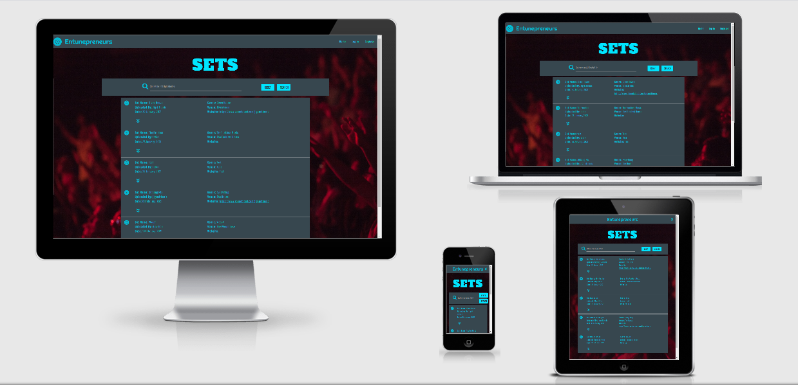

# Entunepreneurs

[View the live website here](https://entunepreneurs.herokuapp.com/)



This is the third Milestone Project for the 
Code Institute's Full Stack Developer course.

In this project, we have been asked to utilise the 
skills that have been developed with HTML, CSS, JavaScript, Python 
and utilising database management systems throughout the course. 
By using these languages and incorporating User input data,
we can create data-based websites that allow
for improved purposes and greater User interaction.
As well as further developing our skills to what is 
expected of a Full Stack Developer and to an industry standard.

As per the standard of Responsive Design, this site is
responsive across several devices, making sure to 
be structured in a cohesive manner and change designs
when appropriate. To further achieve this goal, the site
utilises Materialize and MongoDB, aiding its design and performance 
to shape a site that functions seamlessly across several devices,
utilises User-input data and broaden the skills and knowledge of the author.

This site, *Entunepreneurs*, allows DJs, Music snobs and the general
User to upload their mixes, setlists and playlists to a database. This 
Functions to allow the User to easily track down songs they may wish to buy,
Simply remember and where it can be found on their local drives. A 
caveat of the digital age, where content is abundant and storage keeps
becoming more accessible, through decreased cost and 
technological advances, it can make it difficult to keep a track of 
the content they wish to seek in the future. This is increasingly difficult
with music libraries due to the increased use of streaming services 
serving as the predominant platform for listening to music.
Having a dualistic quality of making it both easier to access music,
but also narrowing content to be what is available on the service and,
in some cases, making it easy to forget songs that are heard elsewhere.

## UX

### User Stories

* First Time Visitor Goals
    1. As a First Time Visitor, I want to be able to access setlists and libraries
    of other User’s or acts that I am interested in.
1.  As a First Time Visitor, I want to be able to easily sign up and create my own
libraries.
1.  As a First Time Visitor, I want to be able to have CRUD capabilities when 
creating my library.

* Returning and Frequent Visitor Goals
    1. As a Returning or Frequent Visitor, I want to be able to amend, edit and delete 
songs from my playlists and the playlists themselves.
1.  As a Returning or Frequent Visitor, I want to be able to easily search other User’s
databases to see similarities or differences between my ideas and their own.
1.  As a Returning or Frequent Visitor, I want a singular portal where all of the songs I
wish to listen to, find and purchase can be easily accessed, from anywhere.

* Site Owner Goals
    1. The Site Owner's goal is to utilise digital platforms, to amass trends within
    other User’s data and gain further insights into what other like-minded
    visitors are visiting the site for.
1.  The Site Owner's goal will be to improve their ability to keep track of their
own collections and wishlists.
1.  The Site Owner wants to add to the ever-growing list of 3rd-party sites that
help to promote the services of content producers and are easily linkable within
their social media and other media platforms. 

### Design

* Colour Scheme
    * The colour scheme used has been akin to the author's signature preference
        to creating 'Dark Mode' aesthetic websites.
    * The author has chosen a cyan and grey base for the majority of elements. 
        Utilising red as a contrasting colour for the background image and 
        appropriate flash messages.
    * By the choice of an unorthodox colour scheme, it also helps to define
        the content, while still keeping a uniformed style across all pages.

* Typography
    * Three fonts have been used across the site. 'Righteous' is the brand font 
        used throughout the website this sets the brand logo and footer to be cohesive.
    * For the h1 tags, 'Alfa Slab One' has been used due to its boldness and dominating
        appearance over the background image. Using cursive as a fallback.
    * For the main text throughout the site, 'Pathway Gothic One' has been used.
        This is a *serious* font that adheres to the conventions of dance-music sites and
        their uniformed aesthetic. This clearly defines head elements as being separate 
        from the main text elements. Using sans-serif as a fallback.

* Imagery
    * The only image used on the site is for the background. This has been taken from
    PixaBay.

* Wireframes
    * [Wireframe](README_files/milestone_3.pdf)

* Database Diagram
    * [Diagram](README_files/entunepreneursDBlink.pdf) or here to see the live version [Live](https://dbdiagram.io/d/6024290380d742080a3a0a69)

## Features

* Responsive across all devices.

* Interactive elements:
    * The driving goal of this site was to allows users to input data that is relevant to
        their musical endeavours.
    * On the Homepage, the User can view all and search through all available sets.
        Once logged in, the User also has the opportunity to amend sets and tracks they have uploaded.           
    * On the Register page, the User can create an account, giving them the ability to fully 
        interact with the site.
    * On the relevant Add pages, the User has the opportunity to add any data that they
        they wish to input into the site.
    * On the relevant Edit pages, the User has the opportunity to edit any data that they
        they have input into the site.
    * The Logout function allows a User to cancel their interaction with the site.
    * The custom 404 page allows the User to go back to whichever page they were seeking,
        while conforming to the general aesthetic across the site.

### Features left to implement

* In the future the author would like to look into implementing embeddable links when
    track previews or sets are uploaded to sites such as Soundcloud and YouTube.
* I also would have liked to have a devoted profile page that Users can access to delete
    their account and all tied data, if they wish.
* To prevent visitors from accessing aspects of the site that require logging in, 
    'if' statements have been used to prevent the access or editing of content that requires a
    login. In the future, the author would like to rebuild the logging in system to use Flask's
    Flask-Login and Flask-SQLAlchemy, or similar packages, to enable better User management.

## Technologies Used

### Languages Used

* [HTML 5](https://en.wikipedia.org/wiki/HTML5)
* [CSS3](https://en.wikipedia.org/wiki/Cascading_Style_Sheets)
* [JavaScript](https://en.wikipedia.org/wiki/JavaScript)
* [Python](https://en.wikipedia.org/wiki/Python_(programming_language))

### Frameworks, Libraries & Programs Used

1. [Google Fonts:](https://fonts.google.com/)
    - Google fonts were used to import the 'Righteous', 'Alfa Slab One' and 'Pathway Gothic One' fonts into the style.css file which is used on all pages throughout the project.
1. [Font Awesome:](https://fontawesome.com/)
    - Font Awesome was used on all pages throughout the website to add icons for aesthetic and UX purposes.
1. [jQuery:](https://jquery.com/)
    - jQuery came with Bootstrap to make the navbar responsive and other Bootstrap functions.
1. [Git:](https://git-scm.com/)
    - Git was used for version control by utilizing the Gitpod terminal to commit to Git and push to GitHub.
1. [GitHub:](https://github.com/)
    - GitHub is used to store the project's code after being pushed from Git.
1. [Balsamiq:](https://balsamiq.com/)
    - Balsamiq was used to create the [wireframes](https://en.wikipedia.org/wiki/Website_wireframe) during the design process.
1. [Microsoft Word:](https://www.microsoft.com/en-gb/microsoft-365/word)
    - Was used to write the content and ensure that the grammatical nature of the content was preserved.
1. [Materialize](https://materializecss.com/)
    - Was used for styling and ensure that the site's functions correctly.
1. [MongoDB](https://www.mongodb.com/)
    - Was used to host the data that form the database and allows the User to input their data and use the CRUD functions to amend and create said data.
1. [Jinja](https://en.wikipedia.org/wiki/Jinja_(template_engine))
    - Allows for template functionality, working alongside Python code and performing various functions to ensure the User only sees what they need to. 
1. [Flask](https://en.wikipedia.org/wiki/Flask_(web_framework))
    - Helps to support other applications that ensure the site functions correctly.

## Testing

### Testing User Stories from User Experience (UX) Section

**Disclaimer: All testing screenshots can be found after the relevant entry via a link.**

* First Time Visitor Goals
    1. As a First Time Visitor, I want to be able to access setlists and libraries
    of other User’s or acts that I am interested in.

    1. On the Hompage, an accordion for each set or playlist can be found, with a search function also included.
         [Homepage Screenshot](README_files/README_images/userstory1evidence.png)

    1. As a First Time Visitor, I want to be able to easily sign up and create my own
        libraries.

        1. The register page easily allows for User's to create their accounts. [Register Screenshot](README_files/README_images/registerevidence.png)
        2. Sets are easily created via a User inputted form, saving to MongoDB  [New Set Screenshot](README_files/README_images/newsetevidence.png)
                

    1. As a First Time Visitor, I want to be able to have CRUD capabilities when 
        creating my library.

        1. Once logged in, the User can easily edit, create and delete their libraries. [CRUD Screenshot](README_files/README_images/crudevidence.png)
        2. The same is true for their tracks, as seen by the former screenshot and this edit page.
        [Edit Tracks Screenshot](README_files/README_images/edittracksevidence.png) 

* Returning and Frequent Visitor Goals
    1. As a Returning or Frequent Visitor, I want to be able to amend, edit and delete 
        songs from my playlists and the playlists themselves.

        1. these two functions can be seen by the above two screenshots and declaration.

    1. As a Returning or Frequent Visitor, I want to be able to easily search other User’s
        databases to see similarities or differences between my ideas and their own.

        1. This can be achieved by the Search function on the homepage. [Search Screenshot](README_files/README_images/searchevidence.png)

    1. As a Returning or Frequent Visitor, I want a singular portal where all of the songs I
        wish to listen to, find and purchase can be easily accessed, from anywhere. 

        1. This can be achieved by the viewing songs accordion dropdown [Tracks Accordion Screenshot](README_files/README_images/songaccess.png)

* Site Owner Goals
    1. The Site Owner's goal is to utilise digital platforms, to amass trends within
        other User’s data and gain further insights into what other like-minded
        visitors are visiting the site for.

        1. By being able to search the sets database and view each track, the Site Owner can view these trends and similarities. 

    1. The Site Owner's goal will be to improve their ability to keep track of their
        own collections and wishlists.

        1. By the very nature of a comprehensive list of their playlists and order, the Site Owner has a portal to view and revisit sets they have made in
            the past.
        2. By including the local file directory, it makes it easy to find songs that may have been lost within the myriad
            of files and disorganisation that is prevalent in the digital age and using multiple storage devices. [Directory Screenshot](README_files/README_images/directoryevidence.png)

    1. The Site Owner wants to add to the ever-growing list of 3rd-party sites that
        help to promote the services of content producers and are easily linkable within
        their social media and other media platforms.   

        1. By adding to the various websites, such as Soundcloud, Mixcloud, Instagram and Facebook (etc), this gives
            User's other means to add to their promotional links.

### Achieved Testing

* Throughout the project, I have been viewing my site across
several devices. Including mobiles, tablets, a range of monitors
with different ratios and utilising the inspect element capability 
on Google Chrome to give me further insight into how the site 
functions across devices that I do not have access to.

* During this period, my main focus was to ensure that the site 
was responsive, followed its theme and was as visually appealing
and useable across all devices.

* Tested creating multiple accounts and creating, updating and deleting data where necessary. 

* Checked all links across all pages lead to the relevant pages.

* All external links open a new tab using the _blank attribute.

### Further Testing

* Ensure that users can access the set information and corroborating tracks that they search for.

### Known Issues

* There are some final little aesthetic issues that I would like to fix:
    * The buttons can sometimes overlap the accordion card when viewed on small devices. 
    * Text can appear quite small on the Navbar when viewed on larger devices.

* My largest issue has been with logging in, for a reason unknown to the author, it brings you to a blank search page on the homepage.

* Another issue is that the ordering of songs within sets can sometimes be out of place.

### Screenshots across different devices

**Disclaimer: Due to the nature of most content only viewable after logging in, it has proven difficult to provide visual evidence of each screenshot, so please refer to the homepage image.**

#### Homepage


### Validators

#### HTML


#### CSS


#### PEP8


## Deployment

### Heroku

The project was deployed to Heroku using the following steps (which can be found here) [Heroku Deployment](https://blog.heroku.com/six-strategies-deploy-to-heroku)...

1. Log in to Heroku and select 'Create New App'
2. You are then presented with the ability to name your app, which is what creates the URL and must be unique.
3. Select the region that is closest to yourself, once selected, click 'Create App'.
4. On the 'Deployment method' section click on the GitHub 'Connect to GitHub' option.
5. Search for your repository using its name with the Heroku Search function, once found, click 'Connect' to connect the repository from GitHub to Heroku.
6. You then need to select the 'Settings' tab and find the 'Reveal Config Vars' button.
7. Upon clicking the 'Reveal Config Vars' button, input the appropriate IP, PORT, SECRET_KEY, MONGO_URI and MONGO_DBNAME fields,
    with their relevant data from the env.py file.
8. Due to the creation of the Procfile and the requirements.txt file, we can select the 'Enable Automatic Deploys' button to ensure any changes pushed to
    GitHub are also synchronised with Heroku.
9. As there is only one branch, we can select the 'Deploy Branch' button to ensure Heroku receives changes from GitHub.
10. Once this is selected, you should see Heroku building our app and a 'Your app was successfully deployed' message should appear.
11. Simply click 'View' below this to view your live website.

### Forking the GitHub Repository

By forking the GitHub Repository we make a copy of the original repository on our GitHub account to view and/or make changes without affecting the original repository by using the following steps...

1. Log in to GitHub and locate the [GitHub Repository](https://github.com/)
2. At the top of the Repository (not top of page) just above the "Settings" button on the menu, locate the "Fork" button.
3. You should now have a copy of the original repository in your GitHub account.

### Making a Local Clone

1. Log in to GitHub and locate the [GitHub Repository](https://github.com/)
2. Under the repository name, click "Clone or download".
3. To clone the repository using HTTPS, under "Clone with HTTPS", copy the link.
4. Open Git Bash
5. Change the current working directory to the location where you want the cloned directory to be made.
6. Type `git clone`, and then paste the URL you copied in Step 3.

```
$ git clone https://github.com/YOUR-USERNAME/YOUR-REPOSITORY
```

7. Press Enter. Your local clone will be created.

```
$ git clone https://github.com/YOUR-USERNAME/YOUR-REPOSITORY
> Cloning into `CI-Clone`...
> remote: Counting objects: 10, done.
> remote: Compressing objects: 100% (8/8), done.
> remove: Total 10 (delta 1), reused 10 (delta 1)
> Unpacking objects: 100% (10/10), done.
```

Click [Here](https://help.github.com/en/github/creating-cloning-and-archiving-repositories/cloning-a-repository#cloning-a-repository-to-github-desktop) to retrieve pictures for some of the buttons and more detailed explanations of the above process.

## Credits

### Content

All content has been written or created by the author.

### Media

The only media used is from [PixaBay](https://pixabay.com/), where the background image can be found via this link [Background Image](https://pixabay.com/photos/people-crowd-concert-show-691777/)

### Acknowledgements

* Thanks to my housemate, girlfriend, mother and other friends for looking at this project 
and conveying that they can view the content and access the interactive functions on their own devices.

* Thanks to my Code Institute Tutor, Mentor and Student Support team for offering me advice and support
during the creation of this project.

* I have utilised extra information to allow me to create this page from
Materialize's documentation and articles that can be found on W3. 

* For minor issues, I have read through the Code Institute's material, 
its Slack channels and, as a last resort, forum posts in Stack Overflow.

* I'd like to acknowledge this [Link](https://flask.palletsprojects.com/en/1.1.x/patterns/errorpages/).
    For showing me how to create custom error pages.

